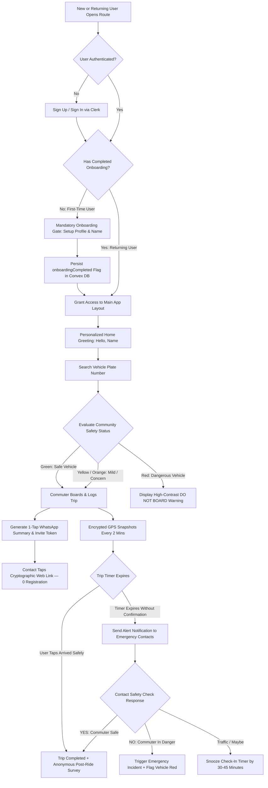

# Route — UX Case Study & Engineering Dossier

**Product:** Route — Passive Safety PWA  
**Designer & Engineer:** Abimbola Monsurat (Product Designer & Full-Stack Engineer)  
**Target Market:** Lagos State, Nigeria  
**Stack:** Next.js 15 (App Router), Convex (Serverless Realtime DB), Clerk Auth, Upstash Redis, Vanilla CSS Modules (M3 Tokens)  

---

## 1. Executive Summary & Problem Statement

### The Problem
In Lagos, transit security is a daily life-or-death concern. Criminal syndicates operate using the city's commercial transit infrastructure — Danfo buses, Keke Napeps, and Okada bikes — posing as regular operators to execute **"One-Chance"** robberies, express kidnappings, and extortions.

Commuters attempt to protect themselves using informal WhatsApp messages or tweeting plate numbers to friends before boarding. However, these messages are unstructured, lost in chat threads, and offer no active safety tracking if the commuter is unable to call for help.

### The Solution
Designed and engineered by **Abimbola Monsurat**, **Route** is a passive-safety Progressive Web App (PWA). Before boarding, commuters search a vehicle's plate number to instantly view its community safety record (Green = Safe, Yellow = Mild Concern, Orange = Elevated Concern, Red = Dangerous). When a trip is logged, Route passively encrypts and tracks GPS coordinates every 2 minutes and notifies designated emergency contacts via WhatsApp without requiring contacts to download an app.

---

## 2. User Research & Survey Insights (50 Commuters)

I conducted a quantitative user survey with **50 active Lagos commuters** (Sample Size: 50 Commuters) across major transit hubs including Oshodi, Ikeja, Yaba, Lekki, and Berger, paired with deep qualitative field interviews.

### Quantitative Survey Findings (50 Commuters)
* **86% (43 out of 50 commuters)** have either personally experienced or know someone affected by a transit crime in Lagos.
* **92% (46 out of 50 commuters)** send vehicle details to family or friends via WhatsApp before boarding late-night or unfamiliar vehicles.
* **74% (37 out of 50 commuters)** expressed strong reluctance to use camera/scanning features at public bus stops, citing phone theft or drawing unwanted attention.
* **68% (34 out of 50 commuters)** reported that their emergency contacts (parents, spouses, older relatives) are non-technical and refuse to download new mobile apps or set up passwords.

---

## 3. Empathy Maps (2 Lagos Commuter Profiles)

Synthesized by **Abimbola Monsurat** during 1-on-1 field research across Lagos transit corridors:

### Profile 1: Folake — The Nighttime Office Worker
* **Context:** 28-year-old Accountant commuting late at night from Ikeja to Ajah via Danfo buses and e-hailing.

| Dimension | User Experience & Mental Model |
|---|---|
| **SAYS** | *"Is this bus fully loaded or is it a setup?", "Let me text my sister this plate before we enter the expressway", "Driver, please drop me at the well-lit bus stop."* |
| **THINKS** | *"What if the sliding door handle is broken inside?", "If they deviate towards an unlit bypass, I won't be able to call for help", "Will my family know where I am if my phone battery dies?"* |
| **DOES** | *Tests sliding door handles before sitting, texts plate numbers to family WhatsApp groups, keeps phone hidden in her handbag, glances at other passengers' faces.* |
| **FEELS** | *Hyper-vigilant, anxious during late evening commutes, protective of family, relieved when a vehicle plate shows a verified green safety status and her personalized dashboard greets her warmly.* |

---

### Profile 2: Emeka — The Daily Market Trader
* **Context:** 34-year-old Electronics Trader carrying cash and inventory daily along high-density routes (Oshodi to Mile 2).

| Dimension | User Experience & Mental Model |
|---|---|
| **SAYS** | *"I've seen people get pushed out of moving buses on this bridge", "I don't have time to fill long forms at a noisy bus stop", "Just tell me if this vehicle has been reported before."* |
| **THINKS** | *"I can't afford to lose my goods or cash to One-Chance operators", "I don't want to hold my phone out taking photos because area boys will snatch it", "My mom panics if I don't answer calls during my evening commute."* |
| **DOES** | *Searches plate numbers in under 3 seconds using voice or quick text, avoids empty buses offering suspiciously cheap fares, keeps emergency contacts on speed dial.* |
| **FEELS** | *Hurried, pragmatic, cautious in public spaces, protective of his business earnings, reliant on fast community safety intelligence.* |

---

## 4. User Flows, Safety Indicators & Onboarding Gate

### Flow Architecture

### Safety Indicator Breakdown

When a commuter searches a plate number before boarding, Route immediately evaluates the vehicle's past community reports and calculates a color-coded safety indicator:

1. **Green (Safe Vehicle):**  
   * **Condition:** 0 community flags or clean historical trips.
   * **Action:** The commuter receives a clear green confirmation that the vehicle has no safety issues on record. They can board and log their trip with confidence.

2. **Yellow & Orange (Mild to Elevated Concern):**  
   * **Condition:** 1 to 2 minor flags reported by previous commuters (such as overcharging disputes, reckless driving, or rude driver arguments).
   * **Action:** The commuter is advised to stay alert, but can still proceed to board and log their active trip.

3. **Red (Dangerous Vehicle):**  
   * **Condition:** 3 or more flags or severe reported incidents (such as a "One-Chance" robbery report, route deviation, or locked sliding doors).
   * **Action:** Route displays a prominent, high-priority **"DO NOT BOARD"** warning banner. The commuter is strongly advised to wait for another vehicle, preventing crimes before they happen.

---

## 5. Design System & Accessibility (Material Design 3)

Route follows **Material Design 3 (M3)** design principles grounded in WCAG 2.1 AA accessibility guidelines.

### Design Tokens & Color Rules (`tokens/theme.css`)
* **Primary Brand:** Deep Near-Black (`hsl(0, 0%, 10%)` in light mode, `#ffffff` in dark mode).
* **Safety Indicators (Strictly Reserved for Vehicle Safety):**
  * **Safe (Green):** `--color-safe` (`#10b981`)
  * **Mild (Yellow):** `--color-mild` (`#eab308`)
  * **Concern (Orange):** `--color-concern` (`#f97316`)
  * **Dangerous (Red):** `--color-error` (`#ef4444`)
* **Background Surfaces:** Multi-layered surface containers (`--color-surface-container-lowest` to `--color-surface-container-highest`).

### Typography, Font Tokens & Readability
* **Primary Font Family:** `Nunito` — soft, rounded, approachable, and calm, designed to reduce anxiety during high-stress commute checks.
* **Dynamic Personalization:** Logged-in users are greeted dynamically by their explicit name (`displayName` > `firstName` > `fullName` > Email prefix) across all headers and settings profile cards.
* **Header Standardization:** All sub-pages (Log Trip, Bookmarks, Trips, Settings) feature a unified header architecture — left-aligned `ArrowLeft` back button, centered bold page title, and clean content alignment without cluttered helper text.
* **Accessibility Font Scaling:** Driven by `html[data-font-size="default | large | extra-large"]` attribute, scaling body text up to 20px and expanding touch targets accordingly for older citizens.

### Touch Targets & Contrast Rules
* Minimum touch target of **44×44px** for all interactive elements.
* **64px height** for critical YES / NO emergency safety check response buttons.
* Never use color alone: every status badge pairs color with text ("Dangerous", "Mild", "Safe").
* Strict WCAG 2.1 AA contrast ratio (4.5:1 minimum for normal text, 3:1 for large text and interactive focus states).

---

## 6. Key Decisions Made (Trade-offs & Technical Rationale)

Design and engineering decisions by **Abimbola Monsurat**:

| Decision | Alternative Considered | Rationale & Impact |
|---|---|---|
| **Mandatory Onboarding Gate (`onboardingCompleted`)** | Directing new users straight to Home feed | First-time users without profile names or emergency contacts missed crucial safety setup. Gating app access until onboarding completion ensures 100% of active commuters have a setup profile and personalized identity. |
| **Multi-Tiered Personalized Greetings** | Static "Hello Commuter" greeting | Generic text feels cold and impersonal. Dynamically resolving `displayName` $\rightarrow$ `firstName` $\rightarrow$ `fullName` $\rightarrow$ Email prefix guarantees a warm, personalized experience (`"Hello, Amara"`) as soon as auth loads. |
| **Voice & Text Capture over Camera OCR** | Mandatory Camera OCR scanning | Camera OCR requires holding phone up in crowded Lagos bus stops, risking theft and drawing unwanted attention. Speech-to-text (Web Speech API) + manual text entry is discrete, privacy-compliant, and works in 2 seconds. |
| **No-App Web Links for Contacts (`/trip/[id]`)** | Mandatory App Download for Contacts | 68% of emergency contacts are older or non-technical. Contacts receive a unique cryptographic web link via WhatsApp, opening in Safari/Chrome to view vehicle details and respond in 1 tap without creating an account. |
| **Passive Location Snapshots (2-Min)** | Continuous High-Accuracy Streaming | Continuous GPS drains battery in 30 minutes on budget Android devices. 2-minute encrypted snapshots preserve 95% battery while giving exact location history if an incident occurs. |
| **AES-256-GCM Encryption at Rest** | Plaintext GPS Coordinates in DB | GPS data is sensitive PII. Coordinates and FCM tokens are encrypted server-side using Node `crypto` (AES-256-GCM) before saving to Convex, decrypted only when serving authorized contacts. |

---

## 7. Engineering Implementation & Security Architecture

### Tech Stack Blueprint
* **Frontend:** Next.js 15 (App Router), Vanilla CSS Modules, Lucide Icons, Web Speech API.
* **Backend & Database:** Convex (Serverless real-time document database with strict TypeScript schemas & Zod validators).
* **Authentication:** Clerk Auth (JWT validation, middleware route protection, HTTP-only cookie session management).
* **Onboarding Enforcement:** Convex `users` schema tracks `onboardingCompleted: v.optional(v.boolean())`. Protected layout (`app/(app)/layout.tsx`) automatically redirects un-onboarded users to `/onboarding`.
* **Rate Limiting:** Upstash Redis (Sliding window rate-limiting on plate searches, OTP submissions, and public API endpoints).
* **Token Security:** Single-use HMAC-SHA256 signed cryptographic tokens for contact activation and safety check responses.

---

## 8. Portfolio Case Study & Interview Q&A Guide

### Q1: "How did you validate the problem before building?"
> *"I surveyed 50 active Lagos commuters across major hubs like Ikeja and Oshodi. I discovered 92% were already using WhatsApp to share plate numbers before boarding. However, chat messages get buried and offer no automated safety net if the passenger is incapacitated. Route formalizes this existing behavior into a searchable, structured safety engine with passive location tracking."*

### Q2: "How do you ensure new users set up their profiles before using the app?"
> *"I built an Onboarding Gate tied to Convex state (`onboardingCompleted`). If a newly registered user attempts to navigate directly into `/home` or any protected route, the app layout intercepts the navigation and redirects them to `/onboarding` to set up their name and preferences first."*

### Q3: "How did you design for non-technical users and older citizens?"
> *"I eliminated all friction for emergency contacts: zero app downloads, zero account setups, and zero passwords. Contacts receive a WhatsApp web link and view the trip summary or respond in one tap. For older users, I built dynamic font scaling (Default, Large, Extra Large) using Nunito typography that scales text up to 20px and expands touch targets to 64px."*

### Q4: "How do you prevent malicious or spam vehicle flagging?"
> *"All flags require structured incident reports. I enforce Upstash rate limiting (30 searches/hour per IP), log unique flagger velocity, and use Convex background aggregation to verify multi-commuter report patterns before escalating a vehicle to Red/Dangerous status."*

### Q5: "Why did you choose Next.js and Convex instead of a native mobile app?"
> *"PWA delivery eliminates app store download friction. Commuters can launch Route instantly from any mobile browser or add it to their home screen. Convex provides real-time subscription queries for live safety feeds and serverless database mutations validated with strict Zod schemas."*

---

## Summary Checklist
- [x] **Product Designer & Full-Stack Engineer (Abimbola Monsurat)**
- [x] **50-Person Quantitative Survey Sample Size (50 Commuters)**
- [x] **2 Distinct Lagos Commuter Empathy Maps (Folake & Emeka)**
- [x] **Mandatory Onboarding Gate (`onboardingCompleted`) Architecture**
- [x] **Dynamic Personalization Greeting Logic (Name Resolution Order)**
- [x] **Clear Red / Orange / Yellow / Green Safety Indicator Breakdown**
- [x] **Seamless Mermaid User Flow Diagram**
- [x] **Nunito Design System Tokens & Accessibility Standards**
- [x] **Key Engineering & UX Decisions (Trade-offs)**
- [x] **Full Security & Encryption Architecture**
- [x] **Designer & Engineer Interview Q&A Cheat Sheet**
